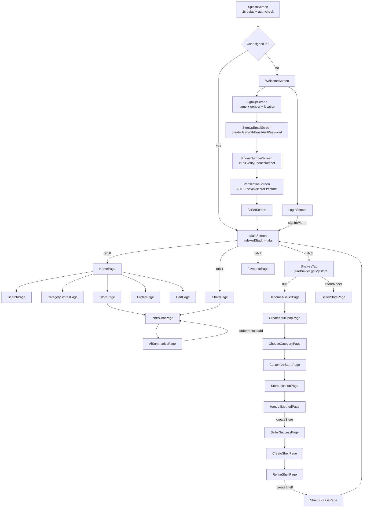
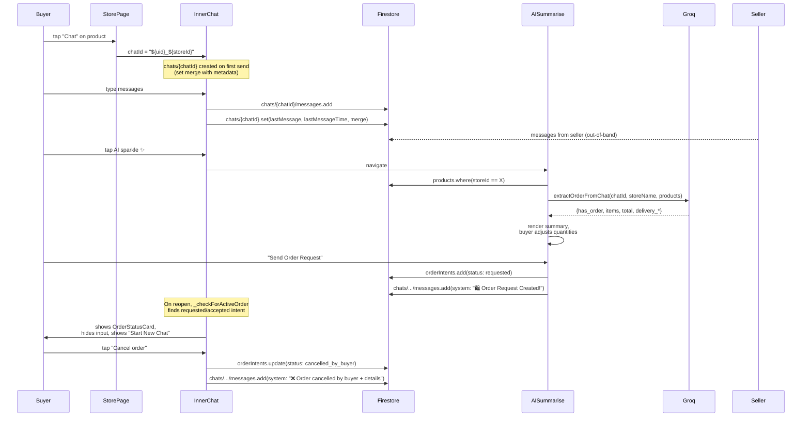
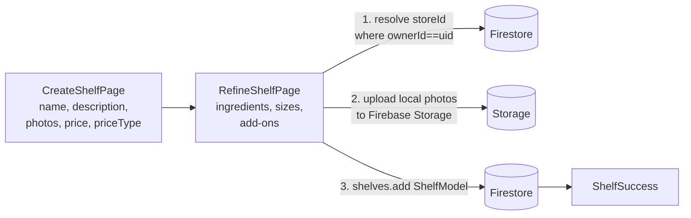

# Sprout — Full Project Context

> **Audience:** Cold-start context document for AI models working on the Sprout
> codebase. Captures everything needed to understand the project without
> exploring the file tree first.
>
> **Scope of this document:** the Flutter app at
> `/Users/abdalameer/Desktop/Sprout/Project/Sprout`. The wider workspace
> (`/Users/abdalameer/Desktop/Sprout`) also contains design assets, brand
> identity files, and Word documents — see [§4 Project Structure](#4-project-structure)
> for the full layout.
>
> **Last updated:** 2026-05-06 · **Branch:** `seller_UI_final_touches` ·
> **Repo:** https://github.com/AliHasanJuma/Sprout.git

---

## Table of Contents

0. [Origin & Documentation Briefs](#0-origin--documentation-briefs)
1. [Project Overview](#1-project-overview)
2. [Goals & Vision](#2-goals--vision)
3. [Tech Stack](#3-tech-stack)
4. [Project Structure](#4-project-structure)
5. [Architecture Overview](#5-architecture-overview)
6. [Features & Screens](#6-features--screens)
7. [Data Models](#7-data-models)
8. [Backend & Services](#8-backend--services)
9. [State Management](#9-state-management)
10. [Authentication Flow](#10-authentication-flow)
11. [Key Business Logic](#11-key-business-logic)
12. [Design System](#12-design-system)
13. [Configuration & Environment](#13-configuration--environment)
14. [Open Questions & TODOs](#14-open-questions--todos)
15. [Glossary](#15-glossary)

---

## 0. Origin & Documentation Briefs

> Source: `/Users/abdalameer/Desktop/Sprout/Documents/Sprout Documentation.docx`
> and `Sprout Phases Roadmap.docx`. Both are .docx (Word) files authored by
> the project owner ("ABDULAMEER", 2026). They are the **authoritative product
> spec** the Flutter codebase is being built against. This section condenses
> them faithfully so any AI working on the code can reason about scope and
> intent without opening Word.
>
> A third file, `The goal is to build a Personal trainer system.docx`, exists
> in the same folder but is **unrelated to Sprout** — it appears to be a
> different/older project draft and should be ignored.

### 0.1 Why Sprout was created (the "why" in the founder's words)

Sprout is a **mobile-first community marketplace** that helps non-professional
creators and hobbyists connect with local buyers — fast, simple, and low-cost.
The mental model the documentation gives is:

> "Your sister selling homemade cookies from her kitchen, a neighbor crafting
> handmade cards, or someone sewing custom items as a side hustle."

Sprout is **explicitly not for** restaurants, logistics-heavy delivery, or
professional businesses. It's a **"digital shelf"** — small creators
showcase what they make, and buyers discover unique local items in one place,
without needing social-media fame or a formal storefront.

**The problem the doc identifies:**

- Small creators struggle to get visibility (social platforms reward popularity, not quality).
- Selling "formally" is intimidating, costly, and complex (CR, ecommerce overhead).
- Buyers want affordable personalized items + trustworthy local sellers, but discovery is stuck in Instagram posts and WhatsApp chats.

**The solution the doc commits to:**

1. Browseable seller "stores" + product "shelves" (each shelf = one product listing).
2. Search + categories (cookies, crafts, sewing, custom gifts, …).
3. **In-app chat** so buyers and sellers connect directly.
4. Community trust signals: ratings, reviews, seller stories.
5. Intentionally **lightweight**: the early prototype does **not** handle
   payments or delivery — buyers and sellers arrange pickup/shipping
   themselves. Sprout's only job is to make discovery and communication
   easy and safe.

**Who it's for:**

- **Sellers:** everyday creators without formal businesses — home bakers,
  handmade crafters, small makers, students, part-time creators, and anyone
  selling non-mass-produced items on a limited budget.
- **Buyers:** community members looking for local, customized, affordable
  products and a convenient way to explore new sellers.

**Launch strategy:** Bahrain first ("a tight-knit market where word-of-mouth
spreads quickly"), then expand to GCC, with English + Arabic supported from
day one.

**Why the name "Sprout":** chosen to reflect *growth at an early stage* —
both noun and verb. Captures freshness, potential, and community-driven
beginnings; subtly evokes food and handmade goods without locking the
platform into one category. Mission framing: *help local talent emerge
and grow naturally*.

**One-sentence pitch (verbatim from the doc):**

> "Sprout is a Bahrain-first, community-driven marketplace that gives
> everyday creators a simple place to be discovered and contacted —
> turning local talent into visible 'shelves' and turning browsing into
> real connections."

### 0.2 Stakeholder model (3 interfaces)

The documentation defines three roles, each with its own interface:

| Role        | Goal                                                                 | Implemented in code? |
|-------------|----------------------------------------------------------------------|----------------------|
| **Buyer**   | Discover local creators, contact them safely, complete pickup/shipping off-platform. | ✅ Most of MVP done |
| **Seller**  | Create a simple storefront, manage inquiries, close deals via chat. | ✅ Onboarding + shelf CRUD live |
| **Admin**   | Keep the community safe, compliant, high-quality (web dashboard).   | ❌ Not built — only the `reports` collection exists |

Buyers can additionally enable seller mode under the same login; the
docs explicitly call this **"two separate profiles under same login"**
with a switch action. In code today, this is collapsed: a user just gains
a `role: 'seller'` flag and a `storeId` after creating a store, and the
Shelves tab transparently routes to the right view. There is no
`buyer/seller switch` UI yet.

### 0.3 MVP scope from the documentation

**Must-have (to launch + test real behavior):**

- **A) Onboarding & accounts** — phone/email signup, buyer mode default, "Become a seller" flow + buyer/seller switch.
- **B) Seller essentials** — store profile (name, area, bio, contact hours), shelf CRUD with photos/title/category/price/lead time/availability, simple store page.
- **C) Buyer essentials** — categories + basic search, shelf details page, save/favourite shelf or seller.
- **D) Chat** — 1:1 buyer↔seller, message templates ("Is this available?"), share location pin + agreed pickup time.
- **E) Soft conversion tracking** — "Request/Reserve" button creates a structured chat card. Seller marks Accepted/Declined/Completed; buyer marks Received (which unlocks reviews).
- **F) Trust & safety (minimum viable)** — Report user/message/listing, Block user, basic anti-spam, community guidelines + food disclaimer before first food chat/request.
- **G) Admin tools (minimum viable)** — reports queue, category management, basic metrics dashboard.

**Nice-to-have (after MVP proves traction):** advanced filters, personalized
"new near you / trending", canned replies library, availability calendar,
auto-generated "Agreed details" summary card, response-time indicators,
push notifications, multi-language UI (Arabic/English), monetisation
(featured shelves, seller subscriptions), automated moderation, dispute
flow, safety meetup suggestions.

**How the code maps against this MVP today:**

| Spec requirement                                              | Code state                                            |
|---------------------------------------------------------------|--------------------------------------------------------|
| Phone OTP signup, buyer-by-default                            | ✅ implemented                                          |
| "Become a seller" + switch                                    | 🚧 onboarding done; explicit role-switch UI missing    |
| Shelf CRUD with photos, category, price, lead-time, availability | 🚧 photos/category/price/sizes/add-ons live; **lead-time + availability toggle missing** |
| Buyer browse + search + favourites                            | ✅ implemented (Haversine sort, debounced relevance search) |
| Chat 1:1                                                      | ✅ Firestore-backed                                     |
| Quick message templates                                       | ❌ not implemented                                      |
| Location pin in chat                                          | ❌ not implemented                                      |
| Soft order: Request → Accept/Decline → Completed → Received   | 🚧 buyer side wired (`orderIntents.status: requested`, `cancelled_by_buyer`); seller-side acceptance UI missing |
| Reviews (gated on Received/Completed)                         | ❌ no `reviews` collection or UI                        |
| Report user/message/listing                                   | 🚧 chat report → `reports` collection ✅; report listing/user UI missing |
| Block user                                                    | ❌ not implemented                                      |
| Community guidelines + food disclaimer                        | ❌ not implemented                                      |
| Admin web dashboard                                           | ❌ not built                                            |
| Bilingual EN/AR + RTL                                         | ❌ not built (only `preferredLanguage: 'en'` saved in Firestore) |

### 0.4 Trust & Safety ruleset (Documentation §2.3)

The doc commits to:

- **Allowed:** handmade crafts, sewing/custom gifts, original art/prints, home services if safe + lawful, **homemade food only under food rules below**.
- **Hard-banned (remove on sight):** weapons & ammunition, drugs/pharmaceuticals, medical equipment, industrial chemicals, fertilizers/pesticides, oil & gas products, tobacco, live animals, waste/scrap, heavy machinery, anything requiring government approval the seller can't show, counterfeits, stolen goods, hate/sexual/threatening content. (Bahrain MOIC list cited.)

**Food category rules (high-risk — listings are "special"):**

- Food listings must include ingredients + allergen tags, prep date / made-to-order flag, storage/handling note, and "Made in a home kitchen" disclosure if true. Photos must be of the actual product (no stock images).
- First time a buyer messages or requests a food seller, the app shows a **Food Safety Notice** modal that requires "I understand" tap.
- Optional **Verified Food** badge for sellers who upload registration/approval; buyers get a "Verified-only" filter.
- Prohibit medical/health claims in food listings.

**Disclaimers Sprout commits to displaying:**

- Sprout is a discovery/communication platform, **does not process payments or delivery in MVP**.
- Buyers/sellers are responsible for confirming price, ingredients, quality, pickup/delivery, and compliance.
- Recommend public meetup locations; never share sensitive info in chat.

**Chat safety rules:** harassment / hate / threats / sexual exploitation / repeated spam / asking for prohibited items are ban-worthy. In-product: Report/Block always visible, rate-limits for new accounts, auto-warning on risky phrases (bank OTP requests, "deposit now", etc.), optional "message requests" before full chat.

**Moderation ladder (in order):** remove listing + warn → temporary chat
restriction → temporary suspension → permanent ban. SLAs: high-severity
reports (weapons/threats/food poisoning) same-day; everything else 24–48h.

**Compliance:** Privacy Policy, only collect what's needed, keep report
logs and moderation decisions, align with Bahrain's Personal Data
Protection Law (consent, purpose limitation, security).

### 0.5 Bilingual requirement (Documentation §2.4) — **not yet implemented**

- Support **English (en) + Arabic (ar)** at launch. Auto-detect from device on first launch; manual override in Settings.
- Full **RTL** layout when Arabic is selected: nav/tab order, back arrow direction, chevrons, text alignment, mirrored padding/margins, swipe direction in carousels. **Avoid hardcoded `left/right`; use `start/end`.**
- UI chrome localized; UGC shown as entered (mixed Arabic/English allowed in listings + chats); search must work across both languages.
- MVP localization scope: onboarding, tabs/nav, categories + filters, listing creation, chat system messages, report/block flows, settings.
- **Typography:** clean Arabic rendering (system font OK for MVP); Arabic numerals vs Western numerals consistent per locale; phone numbers always LTR even inside RTL UI; correct bidi handling so URLs/@handles/phone numbers stay readable in mixed-language chat bubbles.
- **QA acceptance:** language switch flips entire UI without broken layout; no clipped Arabic text; chat shows mixed Arabic/English (especially URLs + phone numbers) correctly.

The current code only stores `preferredLanguage: 'en'` in Firestore at
signup ([verification_screen.dart:62](Project/Sprout/lib/features/auth/verification_screen.dart:62))
and no `flutter_localizations` / ARB files are wired up.

### 0.6 Core entities the documentation defines (§2.5)

The PRD names these entities. Some map cleanly to the current Firestore
schema; some don't yet exist.

| Doc entity                  | Current code/Firestore                                                                          |
|-----------------------------|--------------------------------------------------------------------------------------------------|
| **User**                    | `users/{uid}` (firstName, lastName, gender, email, phoneNumber, location, lat, lng, role, storeId, favouriteStoreIds, preferredLanguage, createdAt). Doc-spec fields *not yet stored*: `area`, `geo_opt_in`, `roles_enabled`, `last_seen_at`. |
| **Store** (seller)          | `stores/{storeId}` (ownerId, name, description, category, logoUrl, imageUrl, lat/lng, address, handoffMethods, rating, createdAt). Doc-spec fields *not yet stored*: `bio` separate from description, `contact_hours`, `policies`, `verification_status`, `status` (active/paused/hidden/banned), `languages_supported`. |
| **Shelf / ProductListing**  | `shelves/{shelfId}` (storeId, name, description, photoPaths, priceType, price, ingredients, sizes, addOns, createdAt). Doc-spec fields *not yet stored*: `category_id` (per-shelf), `tags[]`, `lead_time_days`, `availability` enum (in_stock/made_to_order/paused), `fulfillment_options`, `is_food` flag + `food_metadata` (allergens[], storage_handling_text, made_in_home_kitchen). |
| **Media**                   | Stored as URLs inline on shelves/stores (no dedicated media collection).                        |
| **ChatThread**              | `chats/{chatId}` (buyerId, storeId, storeName, storeImage, lastMessage, lastMessageTime).        |
| **ChatMessage**             | `chats/{chatId}/messages/{msgId}` (text, senderId, senderName, timestamp).                       |
| **OrderIntent / Deal**      | `orderIntents/{id}` (chatId, buyerId, storeId, items[], totalPrice, deliveryMethod, deliveryArea, notes, status, createdAt, updatedAt). Statuses match doc spec: `requested`, `accepted`, `declined`, `cancelled_by_buyer`, `cancelled_by_seller`, `completed_by_seller`, `received_by_buyer`, `disputed`. |
| **Review**                  | ❌ Not implemented. Doc rule: review allowed only if `status >= received_by_buyer`.              |
| **Report**                  | `reports/{id}` (reporterId, reportedStoreId, reportedStoreName, chatId, reason, details, status, timestamp). Reasons in code match doc: Spam / Harassment / Inappropriate content / Fraud / Other. |
| **Block**                   | ❌ Not implemented.                                                                             |
| **Verification**            | ❌ Not implemented.                                                                             |
| **Category**                | ❌ Not a Firestore collection — categories are hardcoded in [home_page.dart:121](Project/Sprout/lib/features/buyer_ui/home_page.dart:121) and [choose_category_page.dart:27](Project/Sprout/lib/features/seller/onboarding/choose_category_page.dart:27). The doc envisions `categories` with `name_en`, `name_ar`, `is_food_category`. |
| **AuditLog / Notification** | ❌ Not implemented.                                                                             |

### 0.7 The 4 canonical user flows (Documentation §2.8)

These are the founder-blessed flows the UI is supposed to deliver. Each
maps to a current code path:

**Flow 1 — Buyer discovers → chats → gets product → reviews (the core flow)**
1. Install + open → choose language (EN/AR) → buyer mode default.
2. Browse / Search a category, e.g. "Cookies" → filter by area (Muharraq) → open listing.
3. Listing details: see price/lead-time/photos → tap **Message Seller**.
4. Chat: send quick template "Is this available for Friday?".
5. Tap **Request/Reserve**; fill quick form (qty=12, date=Fri 6pm, notes "No nuts please") → request card appears in chat (status: Requested).
6. Seller accepts → status Accepted → seller suggests "Pick up at Seef, 6pm".
7. Offline handoff (meetup or off-platform courier).
8. Seller taps Completed → buyer taps Received.
9. Buyer leaves rating + comment.
10. Funnel metrics captured: `view → chat_start → request → accepted → completed → received → review`.

In code today: steps 2/3/4/7 work; step 5 is replaced by the **AI sparkle**
which extracts an order from chat text rather than a structured form;
seller-side accept (step 6/8) and review (step 9) UIs are missing.

**Flow 2 — Seller onboarding → store → first listing**

1. Open app → tap "Become a seller" → create store profile (name, bio, area, languages, contact hours, policies).
2. Tap "Create listing" → add photos + title + category + description + price type + lead time + availability → publish.
3. Listing appears in browse/search → seller receives first message → replies in chat.

In code: step 1 + 2 are split across the 6-step onboarding wizard +
`CreateShelfPage` / `RefineShelfPage`. **Lead time + availability toggle
are not in the form.**

**Flow 3 — Food listing flow**

Selecting Food category enforces extra required fields (ingredients,
allergens, storage/handling, "home kitchen" toggle); a **food safety
disclaimer popup** appears on the buyer's first food message/request.

In code: not implemented. Categories don't have an `is_food` flag and
shelves don't carry food metadata.

**Flow 4 — Anti-spam / safety (block + report)**

Buyer reports an abusive message (reason: harassment/spam/scam) →
blocks the user → thread becomes blocked → admin sees it in the queue.

In code: report works (`reports` collection, 5 reason types). Block
does not exist; admin queue does not exist.

**Flow 5 — Optional verification badge (seller)**

Store settings → "Get Verified" → submit registration docs → admin
approve/reject → "Verified" badge + buyer "Verified-only" filter.

In code: not implemented.

### 0.8 Phases roadmap (`Sprout Phases Roadmap.docx`)

The roadmap divides the build into 8 phases. The Flutter codebase as of
**2026-05-06** sits roughly in **Phase 4** (with Phase 3 mostly done and
Phase 5 partially started for reports). Beta launch (Phase 7) has not
happened.

| Phase | Title                                  | Effort   | Goal                                                                 | Code state    |
|-------|----------------------------------------|----------|-----------------------------------------------------------------------|---------------|
| 0     | Product foundation                     | 1–2 wk   | Lock what's being built; PRD-lite, ERD, MVP scope, T&S rules, bilingual rules. | ✅ done (this doc + Documentation.docx) |
| 1     | UX, branding, UI planning              | 1–3 wk   | Brand kit, screen map, navigation map, RTL UX patterns.               | ✅ Brand kit + Figma exist; RTL skipped |
| 2     | Technical setup & architecture         | 1 wk     | Flutter project, GitHub strategy, Firebase (Auth/Firestore/Storage), env config, localization scaffolding. | ✅ done **except localization scaffolding** |
| 3     | Core buyer experience                  | 2–5 wk   | Auth + buyer profile, browse, search/filter/sort, shelf details, chat initiation. | ✅ done (Firestore-backed) |
| 4     | Seller experience                      | 3–6 wk   | Seller profile (separate under same login), create/edit store, create/edit shelves, image upload, seller inbox, basic insights. | 🚧 in progress — onboarding + shelf CRUD live; shelf options text-based; seller insights hardcoded |
| 5     | Trust, moderation, admin dashboard     | 2–4 wk   | Ratings & reviews, report/block, mandatory terms acceptance, **admin web dashboard**. | 🚧 reports collection only; reviews/block/admin not started |
| 6     | Quality, testing, release prep         | 2–4 wk   | Crash reporting, performance, QA, store readiness checklist.          | ⏳ not started |
| 7     | Launch (soft → wider)                  | —        | Closed beta in Bahrain → broader release.                             | ⏳ not started |

**Phase-level non-functional requirements the roadmap calls out:**

- **Phase 0 NFRs:** budget-first (free tiers where possible), basic privacy policy + user data deletion concept, Firebase rules planning, design queries for Bahrain scale.
- **Phase 1 NFRs:** accessibility baseline (font scaling, contrast), localization-ready layout (RTL safe).
- **Phase 2 NFRs:** Firebase security rules baseline, error logging strategy.
- **Phase 3 NFRs:** fast image loading (compressed thumbnails), offline-friendly browsing (basic caching).
- **Phase 4 NFRs:** storage cost control (limit image size + count — current code does not enforce either), simple validation (prevent empty listings — current code does enforce this).
- **Phase 5 NFRs:** audit trail for reports, restricted admin access.
- **Phase 6–7 NFRs:** app store compliance basics (privacy policy, permissions), performance & stability targets.

### 0.9 Functional requirements as written in the doc (§2.6)

These are the canonical "the system shall…" statements. Numbered by their
category letter so they're searchable:

- **A. Identity & access** — phone or email OTP signup; EN/AR UI selection at onboarding + Settings; buyer mode by default; ability to enable seller mode under the same account; account states active/suspended/banned/deleted.
- **B. Buyer discovery & browsing** — home feed of active listings; browse by categories; keyword search across listings + stores; basic filters (category, area, availability, price type); listing details page; seller store page; favourite listings + stores; show verification badges.
- **C. Seller onboarding & store management** — create + edit store (name, bio/story, area, languages, contact hours, policies); create + edit + pause + archive listings; required fields validation; pause whole store (temporarily not accepting requests).
- **D. Listing media** — multiple photos per listing; enforce media constraints (file type/size/count); generate + serve thumbnails.
- **E. Chat** — 1:1 buyer↔seller; chat initiation from a listing (recommended) or store; text + image messages (MVP); system messages ("Request sent", "Seller accepted"); quick message templates; share location pin (high-value for MVP).
- **F. Soft order intent (no checkout)** — buyer creates Request/Reserve from listing → structured card in chat; seller can Accept/Decline; either party can Cancel with reason (optional); seller marks Completed; buyer marks Received; record timestamps + status transitions for funnel metrics.
- **G. Reviews & ratings** — buyers can rate/review a store (and optionally listing); only allowed once interaction reached Received (or at minimum Completed); aggregate rating + count on store pages; admin can hide/remove abusive reviews.
- **H. Food-specific** — food listings require ingredients + allergen tags + storage/handling + "home kitchen" disclosure; show food disclaimer before first food chat/request; prohibit medical/health claims.
- **I. Trust & safety (user-facing)** — report user/listing/store/message/thread; block another user (no future messages); in-app community guidelines + prohibited items list; basic anti-spam (DM rate limits for new accounts); appeal mechanism (nice-to-have).
- **J. Moderation & admin** — admin reports queue; admin actions (warn, remove listing, hide message, suspend/ban, unban); manage categories + food flags; audit logging; verification workflow (submit → review → verified/rejected).
- **K. Notifications** — push for new chat messages + request status updates; user-configurable preferences (basic).
- **L. Analytics** — track listing views, chat starts, requests created, accept rate, completion rate, received rate; seller-facing basic stats (optional MVP); admin dashboard metrics (MVP).

### 0.10 Non-functional requirements as written (§2.7)

1. **Performance** — home feed <2s on 4G, search <1s, chat real-time, images optimised (thumbnails, lazy load, cache).
2. **Availability & reliability** — 99.5%+ for MVP, resilient to flaky mobile connectivity (offline UI states, retries), idempotent APIs prevent data loss in chat + request transitions.
3. **Security** — TLS everywhere, secure OTP/token handling, RBAC (buyer/seller/admin), rate limits + abuse throttling + input validation, media uploads scanned/validated.
4. **Privacy & compliance** — Bahrain personal data protection (consent, purpose limitation, deletion, secure storage); Privacy Policy + Terms in EN + AR; account deletion flow; minimise PII in logs; defined retention.
5. **Usability & accessibility** — full RTL for Arabic; correct bidi for mixed text; minimal-step critical flows; readable fonts, sufficient contrast, screen reader labels.
6. **Maintainability & extensibility** — data model + APIs designed to extend into payments/delivery later without breaking changes; modular separation (auth, listings, chat, moderation); config-driven categories + filters + prohibited keywords (no hardcoding).
7. **Scalability** — design for Bahrain pilot → GCC expansion; search/indexing handles growth; chat storage scales (pagination, retention, archiving).
8. **Observability & operations** — error rates / latency / crash analytics; auditable admin actions + report outcomes; basic incident response runbook for abuse spikes / safety incidents.
9. **Content safety SLAs** — high-severity reports reviewed same-day; moderation tooling supports quick removal + preventing re-uploads (optional hashing later).
10. **i18n** — externalised strings; locale-aware date/time/number; correct Arabic typography (no truncation).

### 0.11 ERD (Documentation §2.9, prose summary)

The doc describes a **Level-1 ERD** centered on a single `User` identity
that can act as both buyer and seller:

```
User (1) ── owns ──> (0..1) Store
Store (1) ── publishes ──> (0..N) Listing (Shelf)
Listing (N) ── belongs to ──> (1) Category
Listing (1) ── has ──> (0..N) Media
ChatThread connects (1) buyer User <──> (1) seller User
ChatThread (1) ── contains ──> (1..N) ChatMessage
ChatThread (1) ── may host ──> (0..N) OrderIntent
OrderIntent (0..1) ── enables ──> (1) Review (when status >= received_by_buyer)
Store (1) ── accumulates ──> (0..N) Review
Report   (polymorphic target: User | Store | Listing | Message | Thread)
Block    (User → blocks → User; many-to-many self-join)
Verification (1..N per Store; type: business | food)
```

### 0.12 How to use this section

When you (an AI working on this codebase) get a task that touches business
logic, **always cross-reference §0** before writing code:

- A request that adds a new field on a shelf? Check §0.6's Shelf entity to see whether the field is already in the spec (use the spec name).
- A request to add a "Block user" button? It's spec'd (§0.7 Flow 4 + §0.6) but not implemented — design it consistently with the doc's reason codes.
- A request to localize a string? The doc requires EN+AR with full RTL — see §0.5 for QA acceptance criteria before saying a localization task is "done".
- A request to ship payments / delivery? **The doc explicitly says the MVP does NOT handle payments or delivery** (§0.1). Push back unless the user is moving into a post-MVP phase.

---

## 1. Project Overview

**App name:** Sprout (Flutter package name `my_app`, bundle ID `com.example.myApp`)

Sprout is a mobile community marketplace for **Bahrain** that connects local
home-based sellers (baking, perfumes, crafts, gifts, home cooking, fashion,
home decor) with local buyers. Buyers browse and search nearby stores, chat
directly with sellers, build a cart, and place AI-summarised orders inside
the chat. Sellers onboard a store, manage shelves (products) with sizes,
add-ons and ingredients, and pick handoff methods (pickup / delivery /
public meetup). Both sides share a single tab-based shell — the **Shelves**
tab routes to "Become a Seller" if the user has no store, otherwise to
their seller dashboard.

- **Platforms:** iOS, Android (primary). macOS, Web, Windows configs exist
  but are not actively developed.
- **Stage:** Active MVP. Buyer flows wired end-to-end against Firebase;
  seller onboarding + shelf CRUD live; AI order extraction live (Groq).
  Several screens still placeholder (Notifications, "Coming Soon" sheets).
- **Display orientation:** Locked to portrait-only globally
  ([main.dart:13-16](Project/Sprout/lib/main.dart:13)).

---

## 2. Goals & Vision

**Problem:** In Bahrain, a large community of hobbyist creators (home bakers,
crafters, perfumers, home cooks) sell informally through Instagram DMs and
WhatsApp. Discovery is fragmented, ordering is ad-hoc, and there is no
unified marketplace optimized for "near me" community commerce.

**Target users:**
- **Buyers:** Bahrain residents looking for local handmade, baked, and
  artisan products. Discover-by-distance is the core use case.
- **Sellers:** Non-professional home-based makers who want a fast, low-cost
  way to list products and accept orders without building their own
  storefront. Existing Instagram/WhatsApp sellers are the conversion target.

**Core value proposition:**
1. **Local-first discovery** — Haversine-distance sorting against the buyer's
   GPS coordinates ([home_page.dart:136-147](Project/Sprout/lib/features/buyer_ui/home_page.dart:136)).
2. **Conversational commerce** — Buyers chat with sellers natively in-app;
   the AI sparkle button extracts a structured order from the free-form
   chat (Groq llama-3.3-70b) ([groq_order_service.dart](Project/Sprout/lib/core/serivces/groq_order_service.dart)).
3. **Frictionless seller onboarding** — Six guided steps (name → category
   → logo/banner → location → handoff) end with a live store + first
   shelf ([§11.2 Becoming a Seller](#112-becoming-a-seller)).
4. **Flexible handoff** — Customer pickup, local delivery, or public meetup,
   selected per-store and editable any time.

---

## 3. Tech Stack

### 3.1 Framework & language

| Layer            | Technology                                                                 |
|------------------|----------------------------------------------------------------------------|
| Framework        | Flutter (Material design)                                                  |
| Dart SDK         | `^3.9.2`                                                                   |
| App version      | `1.0.0+1`                                                                  |
| Lints            | `flutter_lints ^6.0.0` via `package:flutter_lints/flutter.yaml`            |

### 3.2 Dependencies (from [pubspec.yaml](Project/Sprout/pubspec.yaml))

| Package              | Version       | Purpose                                                       |
|----------------------|---------------|---------------------------------------------------------------|
| `firebase_core`      | `^4.5.0`      | Firebase initialization                                       |
| `firebase_auth`      | `^6.2.0`      | Email/password + phone OTP auth                               |
| `firebase_ui_auth`   | `^3.0.1`      | Pre-built auth widgets (declared, not actively used)          |
| `cloud_firestore`    | `^6.1.3`      | All structured data (users, stores, shelves, chats, orders)   |
| `firebase_storage`   | `^13.3.0`     | Logo/banner/shelf photo uploads                               |
| `flutter_svg`        | `^2.0.10+1`   | SVG rendering (sparkle, delivery, seller-onboarding icons)    |
| `geolocator`         | `^14.0.2`     | GPS coordinates for buyer/seller location                     |
| `geocoding`          | `^4.0.0`      | Reverse geocoding (lat/lng → city, country)                   |
| `image_picker`       | `^1.0.5`      | Gallery image selection (logo, banner, shelf photos)          |
| `path_provider`      | `^2.1.5`      | Local document directory for safely persisted picked images   |
| `shared_preferences` | `^2.5.5`      | Recent search history, language preference                    |
| `http`               | `^1.1.0`      | Groq API calls                                                |
| `cupertino_icons`    | `^1.0.8`      | iOS-style icons                                               |

### 3.3 Dev dependencies

| Package                  | Version    | Purpose                            |
|--------------------------|------------|------------------------------------|
| `flutter_test`           | sdk        | Test framework                     |
| `flutter_launcher_icons` | `^0.13.1`  | Generates launcher icons           |
| `flutter_native_splash`  | `^2.4.0`   | Native splash screen               |

### 3.4 External services

- **Firebase project:** `sprout-c5452` (single project, all env)
- **Groq API:** llama-3.3-70b-versatile, free tier. **API key is hardcoded
  in source** ([groq_order_service.dart:8](Project/Sprout/lib/core/serivces/groq_order_service.dart:8))
  — see [§14 TODOs](#14-open-questions--todos).

### 3.5 Fonts

- **SF Pro Display** (300/400/500/600/700/800/900 + italics) — primary,
  used everywhere via `fontFamily: 'SF Pro Display'`.
- **SF Pro Text** (400/500/600/700) — declared but rarely referenced.

Both bundled under `assets/FONTS/SF PRO/`.

---

## 4. Project Structure

### 4.1 Workspace root (`/Users/abdalameer/Desktop/Sprout/`)

```
Sprout/
├── Project/Sprout/        ← Flutter app (this is where all code lives)
├── Documents/             ← Word docs: original spec, phase roadmap, etc.
│   ├── Sprout Documentation.docx
│   ├── Sprout Phases Roadmap.docx
│   └── The goal is to build a Personal trainer system.docx (legacy/unused)
├── UI design/             ← Figma exports, sketches, inspiration
│   ├── Authentication/    ← Auth screen mockups
│   ├── Buyer UI/, Seller UI/
│   ├── Figma/             ← Master design link
│   ├── Sketches/, UI inspo/
│   ├── category icons/    ← PNG category images
│   ├── widgets/           ← Reusable widget mockups
│   └── app_icon.ai
├── Visual identity/       ← Brand kit, logo variations, brand guidelines.ai
└── database/              ← Data dumps, store logos for seeding
    ├── Data.rtf
    └── logos/             ← 22 store logos (Honey & Thyme, Sweet Bloom, etc.)
```

### 4.2 Flutter app (`Project/Sprout/`)

```
Project/Sprout/
├── lib/                   ← All Dart source (see §4.3)
├── assets/                ← Fonts, icons, images, logos (see §4.4)
├── android/               ← Android native config (google-services.json)
├── ios/                   ← iOS native config (GoogleService-Info.plist)
├── macos/, web/, windows/, linux/  ← Other platform shells
├── test/                  ← Test directory (mostly empty)
├── pubspec.yaml           ← Dependencies + asset/font declarations
├── pubspec.lock
├── firebase.json          ← FlutterFire CLI config
├── flutter_native_splash.yaml
├── analysis_options.yaml  ← Flutter lints
├── context.md             ← Older context doc (March 2026, buyer-only)
└── README.md              ← One-line description
```

### 4.3 lib/ (source tree)

```
lib/
├── main.dart                       ← App entry, locks portrait, inits Firebase
├── firebase_options.dart           ← Auto-generated FlutterFire config
│
├── core/
│   ├── constants/
│   │   └── app_colors.dart         ← AppColors.primary/secondary/tertiary
│   └── serivces/                   ← (typo: "serivces" — keep it)
│       └── groq_order_service.dart ← AI order extraction via Groq HTTP
│
├── data/
│   └── temp_data.dart              ← In-memory mock models + sample stores
│                                     (legacy — most callers now hit Firestore,
│                                     but `Store`/`Product` classes are still
│                                     widely used as the buyer-side DTO)
│
├── models/
│   └── cart_model.dart             ← CartItem (buyer-side cart)
│
├── providers/
│   └── cart_provider.dart          ← Singleton ChangeNotifier for cart state
│
├── features/                       ← Feature-organized code (newer pattern)
│   ├── auth/
│   │   ├── splash_screen.dart      ← 2-sec splash → routing decision
│   │   ├── welcome_screen.dart     ← Sign-up / log-in landing
│   │   ├── sign_up_screen.dart     ← Step 1: name + gender + location
│   │   ├── sign_up_email_screen.dart ← Step 2: email + password
│   │   ├── phone_number_screen.dart  ← Step 3: +973 phone (8 digits)
│   │   ├── verification_screen.dart  ← Step 4: 6-digit OTP
│   │   ├── all_set.dart            ← Sign-up success → MainScreen
│   │   ├── login_screen.dart       ← Email/password login
│   │   └── homescreen.dart         ← LEGACY/dead — early Firestore homepage
│   │
│   ├── buyer_ui/
│   │   ├── Mainscreen.dart         ← IndexedStack tab shell + bottom nav
│   │   └── home_page.dart          ← Home tab: header, categories, banner, near-me
│   │
│   └── seller/                     ← Full seller experience
│       ├── shelves_tab.dart        ← Shelves tab router (no store → onboarding,
│       │                             else → SellerStorePage)
│       ├── models/
│       │   ├── store_model.dart    ← StoreModel + StoreLocation + HandoffMethod
│       │   └── shelf_model.dart    ← ShelfModel + SizeOption + AddOnOption + PriceType
│       ├── services/
│       │   ├── seller_service.dart ← Firestore CRUD for `stores/`
│       │   └── shelf_service.dart  ← Firestore CRUD for `shelves/`
│       ├── onboarding/             ← 6-step seller onboarding wizard
│       │   ├── become_a_seller_page.dart
│       │   ├── create_your_shop_page.dart
│       │   ├── choose_category_page.dart
│       │   ├── customize_store_page.dart
│       │   ├── store_location_page.dart
│       │   ├── handoff_method_page.dart
│       │   └── seller_success_page.dart
│       ├── store/
│       │   └── seller_store_page.dart  ← Seller's own dashboard view
│       ├── shelf/
│       │   ├── create_shelf_page.dart  ← Step 1: name, photos, price
│       │   ├── refine_shelf_page.dart  ← Step 2: ingredients, sizes, add-ons → Firestore
│       │   ├── edit_shelf_page.dart    ← Combined-form edit existing shelf
│       │   └── shelf_success_page.dart
│       ├── settings/               ← Seller's "Store settings" page + edit deeplinks
│       │   ├── store_settings_page.dart
│       │   ├── edit_name_bio_page.dart
│       │   ├── edit_logo_banner_page.dart   ← FutureBuilder → CustomizeStorePage(isEditing)
│       │   ├── edit_category_page.dart      ← FutureBuilder → ChooseCategoryPage(isEditing)
│       │   ├── edit_location_page.dart      ← FutureBuilder → StoreLocationPage(isEditing)
│       │   ├── edit_handoff_method_page.dart ← FutureBuilder → HandoffMethodPage(isEditing)
│       │   ├── delete_shelf_page.dart       ← List + per-shelf delete confirm
│       │   └── delete_store_dialog.dart     ← Show modal + tear down store
│       └── widgets/
│           ├── seller_app_bar.dart       ← White AppBar with back arrow
│           ├── seller_select_card.dart   ← Card with SVG icon + checkbox
│           ├── seller_settings_row.dart  ← Settings list row with chevron
│           └── seller_tag_chip.dart      ← Removable tag chip (ingredients)
│
├── pages/                          ← Legacy folder name (mixed with features/)
│   ├── cart_page.dart              ← Buyer cart with "Send Order to Chat"
│   └── categories/
│       ├── category_stores_page.dart ← Filtered store list per category
│       └── special_categories/
│           ├── new_stores_page.dart       ← Banner card 1
│           ├── featured_stores_page.dart  ← Banner card 2
│           └── top_rated_page.dart        ← Banner card 3 (sorts tempStores)
│
├── screens/                        ← Buyer-side screens (older folder)
│   ├── store_page.dart             ← Public store view (StreamBuilder products)
│   ├── chats_page.dart             ← Chat list (Firestore stream)
│   ├── inner_chat_page.dart        ← 1:1 chat with messages + order status card
│   ├── ai_summarise_page.dart      ← Groq → order intent + Firestore write
│   ├── search_page.dart            ← Live search with relevance scoring
│   ├── search_result_page.dart     ← Static query result page (legacy)
│   ├── favourite_page.dart         ← User favourites (Firestore favouriteStoreIds)
│   ├── profile_page.dart           ← Profile + Personal Details edit form
│   ├── customize_store_page.dart   ← LEGACY/dead — replaced by features/seller/onboarding/customize_store_page.dart
│   └── category_page.dart          ← Placeholder ("Coming Soon")
│
└── shared/widgets/                 ← Cross-feature widgets
    ├── navbar.dart                 ← CustomNavBar (4 tabs, white, upward shadow)
    ├── search_bar.dart             ← CustomSearchBar (white pill, hint)
    ├── app_top_bar.dart            ← AppTopBar (white AppBar, back arrow)
    ├── custom_button.dart          ← CustomButton (full-width, rounded)
    ├── custom_textfield.dart       ← CustomTextField (label above input)
    └── order_status_card.dart      ← In-chat order status pill + cancel
```

### 4.4 assets/

```
assets/
├── FONTS/SF PRO/
│   ├── Display/  (15 weights/styles)
│   └── Text/     (4 weights)
├── logo/
│   ├── app_icon.png            ← Launcher icon source
│   ├── logoBlack.png           ← Splash logo (320×320)
│   ├── logoBlack_fullsize.png  ← Home header logo (100×40)
│   ├── logodark_green.png      ← Welcome screen logo
│   ├── logoneon_green.png
│   ├── logowhite.png
│   └── logomark/
├── icons/                      ← Illustration-style PNGs
│   ├── Profile_picture.png         ← Default avatar
│   ├── Search_Local.png            ← AllSetScreen illustration
│   ├── MG_favourite_list.png       ← Favourite empty state
│   ├── Seller_picture.png          ← Become-a-seller illustration
│   ├── Digital_shelf.png           ← Shelf success illustration
│   ├── Ingredient_list.png         ← Expanded product card icon
│   ├── New_badge.png, Verified_badge.png, Offers.png, Growth.png,
│   │ Fast_responder.png, Fails_to_load.png, No_search_return.png, Chat.png
├── images/
│   ├── category/   (Baking.png, Crafts.png, fastion.png, gift.png,
│   │                home-cooking.png, perfume.png — note "fastion" typo)
│   └── home page widgets/
│       └── 0001.png            ← Generic placeholder (banner, store, product)
├── Essentials/
│   ├── bowdesign.svg           ← Original Figma wave (now replaced by _BowClipper)
│   └── Added/
│       ├── star.svg            ← AI sparkle icon
│       └── delivery.svg        ← Delivery icon
├── Becpme a seller icons/       ← (typo "Becpme" — kept as-is in code)
│   ├── fire.svg, Audience.svg, Tools.svg
│   ├── Customer Pickup.svg, Local Delivery.svg, Public Meetup.svg
└── UI icons package/PNG/
    ├── Black/{Arrow, Communication, Edit, File, Interface, Media,
    │           Menu, Navigation}/
    └── White/Communication/    ← White variants for chat button
```

Critical asset paths used in code:
- `assets/UI icons package/PNG/Black/Arrow/Arrow_Left_MD.png` — back arrow
- `assets/UI icons package/PNG/Black/Navigation/House_01.png` — nav: Home
- `assets/UI icons package/PNG/Black/Communication/Chat_Circle.png` — nav: Chat
- `assets/UI icons package/PNG/Black/Interface/Heart_01.png` — nav: Favourite
- `assets/UI icons package/PNG/Black/Edit/Rows.png` — nav: Shelves
- `assets/UI icons package/PNG/Black/Interface/Shopping_Cart_01.png` — home cart icon
- `assets/UI icons package/PNG/Black/File/File_Upload.png` — upload buttons
- `assets/UI icons package/PNG/Black/Edit/Add_Plus_Square.png` — "Add an X" rows
- `assets/UI icons package/PNG/Black/Edit/Edit_Pencil_Line_01.png` — edit shelf button
- `assets/UI icons package/PNG/Black/Menu/More_Horizontal.png` — store settings entry

---

## 5. Architecture Overview

### 5.1 Layered architecture

```
┌──────────────────────────────────────────────────────────────────────┐
│ UI LAYER  (Stateful/Stateless Widgets)                               │
│  features/auth/*, features/buyer_ui/*, features/seller/*,             │
│  screens/*, pages/*, shared/widgets/*                                 │
└──────────────────────────────────────────────────────────────────────┘
                                │
                                ▼
┌──────────────────────────────────────────────────────────────────────┐
│ STATE LAYER                                                          │
│  • Local: setState everywhere                                        │
│  • Global cart: providers/cart_provider.dart (singleton ChangeNotifier)│
│  • In-page Firestore listeners: StreamSubscription / StreamBuilder   │
│  • Cross-tab refresh: SellerReloadNotification (NotificationListener)│
└──────────────────────────────────────────────────────────────────────┘
                                │
                                ▼
┌──────────────────────────────────────────────────────────────────────┐
│ SERVICE LAYER (singletons)                                           │
│  • SellerService          (stores collection CRUD + image upload)    │
│  • ShelfService           (shelves collection CRUD + image upload)   │
│  • GroqOrderService       (HTTP → Groq → JSON order)                 │
└──────────────────────────────────────────────────────────────────────┘
                                │
                                ▼
┌──────────────────────────────────────────────────────────────────────┐
│ BACKEND                                                              │
│  Firebase Auth   ·   Cloud Firestore   ·   Firebase Storage          │
│  Groq API (api.groq.com/openai/v1)                                   │
└──────────────────────────────────────────────────────────────────────┘
```

There is **no formal repository pattern** — many widgets call Firestore
directly via `FirebaseFirestore.instance` rather than going through a
service. The two `Service` singletons (`SellerService`, `ShelfService`) are
the cleanest abstraction layer; everything else is ad-hoc.

### 5.2 Folder organization quirks

The codebase shows two organizational generations layered on top of each
other:

| Generation | Pattern                                 | Example                             |
|------------|-----------------------------------------|-------------------------------------|
| Older      | `lib/screens/` flat                     | `screens/store_page.dart`           |
| Older      | `lib/pages/` flat                       | `pages/cart_page.dart`              |
| Newer      | `lib/features/<feature>/...`            | `features/seller/store/seller_store_page.dart` |

When adding code, prefer the **newer `features/`** layout. Don't move
existing files mid-feature unless there's a clear reason — many cross-imports
already exist (e.g. `features/seller/onboarding/seller_success_page.dart`
imports `features/buyer_ui/Mainscreen.dart`).

### 5.3 Navigation flow (high level)



---

## 6. Features & Screens

Status legend: ✅ done · 🚧 partial · ⏳ planned/placeholder

### 6.1 Auth tab

| Screen                  | File                                                          | Purpose                                                            | Status |
|-------------------------|---------------------------------------------------------------|--------------------------------------------------------------------|--------|
| `SplashScreen`          | [splash_screen.dart](Project/Sprout/lib/features/auth/splash_screen.dart)             | 2s delay → `authStateChanges().first` → MainScreen or WelcomeScreen | ✅ |
| `WelcomeScreen`         | [welcome_screen.dart](Project/Sprout/lib/features/auth/welcome_screen.dart)           | Logo + "Connect, Craft & Share." + Sign Up / Log In buttons         | ✅ |
| `SignUpScreen`          | [sign_up_screen.dart](Project/Sprout/lib/features/auth/sign_up_screen.dart)           | First name, last name, gender toggle, **location with GPS detect**  | ✅ |
| `SignUpEmailScreen`     | [sign_up_email_screen.dart](Project/Sprout/lib/features/auth/sign_up_email_screen.dart) | Email + password validation + `createUserWithEmailAndPassword`    | ✅ |
| `PhoneNumberScreen`     | [phone_number_screen.dart](Project/Sprout/lib/features/auth/phone_number_screen.dart)  | +973 hard-coded, 8 digits formatted as `XXXX XXXX`, debug-only `appVerificationDisabledForTesting` | ✅ |
| `VerificationScreen`    | [verification_screen.dart](Project/Sprout/lib/features/auth/verification_screen.dart)  | 6 OTP boxes, signs in, **writes user doc to Firestore**, `updateDisplayName` | ✅ |
| `AllSetScreen`          | [all_set.dart](Project/Sprout/lib/features/auth/all_set.dart)                          | Success illustration + "Start exploring" → MainScreen               | ✅ |
| `LoginScreen`           | [login_screen.dart](Project/Sprout/lib/features/auth/login_screen.dart)                | Email + password → MainScreen. Forgot Password button is a no-op    | 🚧 |
| `Homescreen` (legacy)   | [homescreen.dart](Project/Sprout/lib/features/auth/homescreen.dart)                    | Early Firestore home + sign out — **dead code**                     | ⏳ |

### 6.2 Main shell + bottom nav

`MainScreen` ([Mainscreen.dart](Project/Sprout/lib/features/buyer_ui/Mainscreen.dart))
holds an `IndexedStack` of 4 pages and a `CustomNavBar`. Tab pages are
instantiated **once** as `const` literals so each is preserved across tab
switches. Several pages additionally implement `AutomaticKeepAliveClientMixin`
for nested scroll/stream state.

| Idx | Tab      | File                                                  | Notes                                                  |
|-----|----------|-------------------------------------------------------|--------------------------------------------------------|
| 0   | Home     | [home_page.dart](Project/Sprout/lib/features/buyer_ui/home_page.dart)         | Auth-listening near-me feed                            |
| 1   | Chat     | [chats_page.dart](Project/Sprout/lib/screens/chats_page.dart)                 | Firestore stream (KeepAlive)                           |
| 2   | Favourite | [favourite_page.dart](Project/Sprout/lib/screens/favourite_page.dart)        | Pull-to-refresh + KeepAlive                            |
| 3   | Shelves  | [shelves_tab.dart](Project/Sprout/lib/features/seller/shelves_tab.dart)       | Routes to `BecomeASellerPage` or `SellerStorePage`     |

### 6.3 Buyer flow screens

| Screen                  | File                                                                                  | Purpose                                                                            | Status |
|-------------------------|---------------------------------------------------------------------------------------|------------------------------------------------------------------------------------|--------|
| `HomePage`              | [home_page.dart](Project/Sprout/lib/features/buyer_ui/home_page.dart)                 | Header (logo + welcome + cart badge + avatar + bow), categories row, banner PageView, **Firestore stores sorted by Haversine distance** | ✅ |
| `SearchPage`            | [search_page.dart](Project/Sprout/lib/screens/search_page.dart)                       | Auto-focus, **debounced live Firestore search with relevance scoring (100/75/50/25)**, recent searches via `SharedPreferences` | ✅ |
| `SearchResultPage`      | [search_result_page.dart](Project/Sprout/lib/screens/search_result_page.dart)         | Static result page, mostly superseded by SearchPage live results                   | 🚧 |
| `CategoryStoresPage`    | [category_stores_page.dart](Project/Sprout/lib/pages/categories/category_stores_page.dart) | Filtered store list by `category` field (Firestore `where`)                  | ✅ |
| `NewStoresPage`         | [new_stores_page.dart](Project/Sprout/lib/pages/categories/special_categories/new_stores_page.dart)        | Banner "All stores are new" — uses `tempStores` (TODO: filter by `createdAt`)| 🚧 |
| `FeaturedStoresPage`    | [featured_stores_page.dart](Project/Sprout/lib/pages/categories/special_categories/featured_stores_page.dart) | Featured banner — uses `tempStores`                                       | 🚧 |
| `TopRatedPage`          | [top_rated_page.dart](Project/Sprout/lib/pages/categories/special_categories/top_rated_page.dart)         | Sorts `tempStores` by rating descending                                          | 🚧 |
| `StorePage`             | [store_page.dart](Project/Sprout/lib/screens/store_page.dart)                         | Bow header + name/bio + Rating/Category/Distance row + **Firestore products stream** + favourite heart (Firestore `favouriteStoreIds` array) + product order sheet + floating cart bar | ✅ |
| `CartPage`              | [cart_page.dart](Project/Sprout/lib/pages/cart_page.dart)                             | Per-store cart, Dismissible removal, "Send Order to Chat" → InnerChatPage with chatId `${uid}_${storeId}` | ✅ |
| `ChatsPage`             | [chats_page.dart](Project/Sprout/lib/screens/chats_page.dart)                         | Firestore stream of `chats where buyerId==uid` ordered by `lastMessageTime`, swipe-to-delete | ✅ |
| `InnerChatPage`         | [inner_chat_page.dart](Project/Sprout/lib/screens/inner_chat_page.dart)               | Stream of `chats/{id}/messages`, `OrderStatusCard` if active order, AI sparkle button, send-message UI, report sheet → `reports` collection. **Hides input + shows "Start New Chat" if active order exists.** | ✅ |
| `AiSummarisePage`       | [ai_summarise_page.dart](Project/Sprout/lib/screens/ai_summarise_page.dart)           | Calls `GroqOrderService.extractOrderFromChat`, lets buyer adjust quantities, writes `orderIntents` doc + system message | ✅ |
| `FavouritePage`         | [favourite_page.dart](Project/Sprout/lib/screens/favourite_page.dart)                 | Reads `users/{uid}.favouriteStoreIds`, fetches matching `stores` with `whereIn`. Optimistic remove. Pull-to-refresh. | ✅ |
| `ProfilePage`           | [profile_page.dart](Project/Sprout/lib/screens/profile_page.dart)                     | Bow header + avatar + name/email, settings sections (Account, Preferences, Danger Zone), `_PersonalDetailsPage` saves to Firestore, `Sign Out` and `Delete Account` modals | ✅ |
| `_PersonalDetailsPage`  | (inside profile_page.dart)                                                            | Edit firstName / lastName / gender / phoneNumber → Firestore update                | ✅ |
| `CategoryPage`          | [category_page.dart](Project/Sprout/lib/screens/category_page.dart)                   | Stub "Category Page - Coming Soon"                                                 | ⏳ |
| `customize_store_page.dart` (screens/) | [customize_store_page.dart](Project/Sprout/lib/screens/customize_store_page.dart) | **DEAD CODE** — prototype, replaced by features/seller/onboarding version | ⏳ |

### 6.4 Seller flow screens

#### Onboarding (chained)

| Screen                  | File                                                                                       | Purpose                                                                         |
|-------------------------|--------------------------------------------------------------------------------------------|---------------------------------------------------------------------------------|
| `BecomeASellerPage`     | [become_a_seller_page.dart](Project/Sprout/lib/features/seller/onboarding/become_a_seller_page.dart) | Hero illustration + 3 feature rows + "Launch Your Shop" CTA               |
| `CreateYourShopPage`    | [create_your_shop_page.dart](Project/Sprout/lib/features/seller/onboarding/create_your_shop_page.dart) | Shop name (≥3 chars, must contain a-zA-Z OR Arabic أ-ي), bio (≥10 chars), terms checkbox |
| `ChooseCategoryPage`    | [choose_category_page.dart](Project/Sprout/lib/features/seller/onboarding/choose_category_page.dart) | Single-select from 6 categories (also reused with `isEditing: true`)        |
| `CustomizeStorePage`    | [customize_store_page.dart](Project/Sprout/lib/features/seller/onboarding/customize_store_page.dart) | Logo + banner from gallery, **persisted to app's docs directory** (so they survive cache clears before upload) |
| `StoreLocationPage`     | [store_location_page.dart](Project/Sprout/lib/features/seller/onboarding/store_location_page.dart)  | Pre-fills from buyer's `users/{uid}.location` if set; GPS crosshair fallback. **Requires real lat/lng** before continuing |
| `HandoffMethodPage`     | [handoff_method_page.dart](Project/Sprout/lib/features/seller/onboarding/handoff_method_page.dart)  | Multi-select from 3 methods. **This is where `SellerService.createStore` is called.** |
| `SellerSuccessPage`     | [seller_success_page.dart](Project/Sprout/lib/features/seller/onboarding/seller_success_page.dart)  | "Congratulations" + "Add Product" → CreateShelfPage, or "I'll do this later" → MainScreen tab 0 |

#### Shelf creation/editing

| Screen                  | File                                                                                         | Purpose                                                                       |
|-------------------------|----------------------------------------------------------------------------------------------|-------------------------------------------------------------------------------|
| `CreateShelfPage`       | [create_shelf_page.dart](Project/Sprout/lib/features/seller/shelf/create_shelf_page.dart)    | Step 1: name, description, photos, fixed/starting-at price toggle             |
| `RefineShelfPage`       | [refine_shelf_page.dart](Project/Sprout/lib/features/seller/shelf/refine_shelf_page.dart)    | Step 2: ingredient chips, sizes (size + price modifier), add-ons (name + price modifier). **Resolves storeId, uploads photos, writes `shelves` doc.** |
| `EditShelfPage`         | [edit_shelf_page.dart](Project/Sprout/lib/features/seller/shelf/edit_shelf_page.dart)        | Single-form combining create + refine for editing                             |
| `ShelfSuccessPage`      | [shelf_success_page.dart](Project/Sprout/lib/features/seller/shelf/shelf_success_page.dart)  | "Your Shelf is Live!" → MainScreen tab 3 (Shelves)                            |

#### Seller dashboard + settings

| Screen                  | File                                                                                       | Purpose                                                                      |
|-------------------------|--------------------------------------------------------------------------------------------|------------------------------------------------------------------------------|
| `SellerStorePage`       | [seller_store_page.dart](Project/Sprout/lib/features/seller/store/seller_store_page.dart)  | Banner header + logo + name/bio + **Views/Rating/Orders stats (currently hard-coded 84/3.5/5)** + expandable shelf list with edit. Pull-to-refresh dispatches `SellerReloadNotification`. |
| `StoreSettingsPage`     | [store_settings_page.dart](Project/Sprout/lib/features/seller/settings/store_settings_page.dart) | "Store management" / "Shelves management" / "Danger zone" sections        |
| `EditNameBioPage`       | [edit_name_bio_page.dart](Project/Sprout/lib/features/seller/settings/edit_name_bio_page.dart) | FutureBuilder + `SellerService.updateStore`                              |
| `EditLogoBannerPage`    | [edit_logo_banner_page.dart](Project/Sprout/lib/features/seller/settings/edit_logo_banner_page.dart) | Wraps `CustomizeStorePage(isEditing: true)`                            |
| `EditCategoryPage`      | [edit_category_page.dart](Project/Sprout/lib/features/seller/settings/edit_category_page.dart) | Wraps `ChooseCategoryPage(isEditing: true)`                              |
| `EditLocationPage`      | [edit_location_page.dart](Project/Sprout/lib/features/seller/settings/edit_location_page.dart) | Wraps `StoreLocationPage(isEditing: true)`                              |
| `EditHandoffMethodPage` | [edit_handoff_method_page.dart](Project/Sprout/lib/features/seller/settings/edit_handoff_method_page.dart) | Wraps `HandoffMethodPage(isEditing: true)`                          |
| `DeleteShelfPage`       | [delete_shelf_page.dart](Project/Sprout/lib/features/seller/settings/delete_shelf_page.dart) | List shelves with per-row delete confirmation                            |
| `delete_store_dialog`   | [delete_store_dialog.dart](Project/Sprout/lib/features/seller/settings/delete_store_dialog.dart) | `showDeleteStoreDialog(BuildContext)` → `SellerService.deleteStore` → MainScreen |

---

## 7. Data Models

Sprout has **two sets of data classes** because of the older buyer code-path
that was originally in-memory:

1. **Firestore-backed** (`features/seller/models/*`) — used for seller
   stores and shelves. Have `toMap` / `fromMap` for Firestore.
2. **In-memory DTOs** (`data/temp_data.dart`) — `Store`, `Product`,
   `ChatThread`, `ChatMessage`, `UserProfile`, `FavouriteItem`. The buyer
   code maps Firestore docs **into** these classes at the call site (e.g.
   `home_page.dart`, `store_page.dart`, `favourite_page.dart`, `search_page.dart`)
   because `StorePage` was originally written against `Store`.

Always check whether the consuming widget expects the Firestore-shape or
the temp-data-shape before passing data around.

### 7.1 In-memory buyer DTOs ([temp_data.dart](Project/Sprout/lib/data/temp_data.dart))

```dart
class Store {
  final String id, name, description, category, imagePath, logoPath;
  final double rating, distanceKm;
  final List<Product> products;
}

class Product {
  final String id, name, description, imagePath;
  final double price;
  final List<String>? ingredients;
  final List<String>? sizes;            // e.g. ['Small', 'Medium', 'Large']
  final List<Map<String, dynamic>>? addons;  // [{name: String, price: double}]
  final String? allergens;
  final String? nutritionalInfo;
  final String? weight;
}

class ChatThread {
  final String id, contactName, initials, lastMessage, timeAgo;
  final int unreadCount;
  final bool isOnline;
  final List<ChatMessage> messages;
  final String? storeId;
}

class ChatMessage {
  final String text;
  final bool isSentByMe;
  final String timeAgo;
}

class UserProfile { firstName, lastName, email, phoneCountryCode, phoneNumber, gender }
class FavouriteItem { storeId, storeName, imagePath, rating }
```

`tempStores` (5 sample stores), `tempChatThreads`, `tempUserProfile`,
`tempFavourites`, and `tempRecentSearches` are defined here. **Most
production paths now ignore these** in favour of Firestore queries — but
`Store`/`Product` classes are still used as DTOs.

### 7.2 Cart model ([cart_model.dart](Project/Sprout/lib/models/cart_model.dart))

```dart
class CartItem {
  final String productId;            // includes timestamp suffix for uniqueness
  final String productName;
  final String storeId;
  final String storeName;
  final double unitPrice;
  int quantity;
  final String? selectedSize;
  final List<String> selectedAddons;
  final double addonsTotal;
  final String? specialInstructions;
  final String? productImageUrl;

  double get totalPrice => (unitPrice + addonsTotal) * quantity;
}
```

### 7.3 Seller models ([store_model.dart](Project/Sprout/lib/features/seller/models/store_model.dart) · [shelf_model.dart](Project/Sprout/lib/features/seller/models/shelf_model.dart))

```dart
enum HandoffMethod { customerPickup, localDelivery, publicMeetup }

class StoreLocation {
  final double lat;
  final double lng;
  final String address;
}

class StoreModel {
  final String? id;
  final String name;
  final String bio;
  final String? category;
  final String? logoPath;     // Local file path OR https:// URL
  final String? bannerPath;   // Local file path OR https:// URL
  final StoreLocation? location;
  final List<HandoffMethod> handoffMethods;
}

enum PriceType { fixed, startingAt }

class SizeOption { final String size; final double priceModifier; }
class AddOnOption { final String name; final double priceModifier; }

class ShelfModel {
  final String? id;
  final String storeId;
  final String name;
  final String description;
  final List<String> photoPaths;     // Local OR https:// URLs
  final PriceType priceType;
  final double price;
  final List<String> ingredients;
  final List<SizeOption> sizes;
  final List<AddOnOption> addOns;
  final DateTime? createdAt;
}
```

### 7.4 Firestore collections

> No `firestore.rules` file exists in the project — security rules live
> only in the Firebase console.

#### `users/{uid}`

Written by [verification_screen.dart:50-65](Project/Sprout/lib/features/auth/verification_screen.dart:50)
on signup, partially updated by [profile_page.dart:_PersonalDetailsPage](Project/Sprout/lib/screens/profile_page.dart:299)
and [store_page.dart heart toggle](Project/Sprout/lib/screens/store_page.dart:758).

```jsonc
{
  "uid": "string",
  "firstName": "string",
  "lastName": "string",
  "email": "string",
  "gender": "Male" | "Female",
  "phoneNumber": "+9733333 3333",
  "location": "Manama, Bahrain",     // text, from geocoding
  "latitude": 26.0667,                 // double
  "longitude": 50.5577,                // double
  "preferredLanguage": "en",
  "createdAt": Timestamp,
  "role": "buyer" | "seller",          // upgraded by SellerService.createStore
  "storeId": "string",                 // present iff role == 'seller'
  "favouriteStoreIds": ["storeId1", …] // arrayUnion / arrayRemove
}
```

#### `stores/{storeId}` — written by [SellerService](Project/Sprout/lib/features/seller/services/seller_service.dart)

```jsonc
{
  "ownerId": "uid",
  "name": "string",
  "description": "string",        // (= StoreModel.bio)
  "category": "Sweets and baking" | "Home cooking" | "Gifts"
            | "Crafts and Home decor" | "Perfumes" | "Fashion",
  "logoUrl": "https://…",         // Firebase Storage URL
  "imageUrl": "https://…",        // banner; Firebase Storage URL
  "latitude": 26.0,
  "longitude": 50.0,
  "address": "string",
  "handoffMethods": ["customerPickup","localDelivery","publicMeetup"],
  "rating": 0.0,
  "createdAt": Timestamp,
  "updatedAt": Timestamp
}
```

> Note: SellerService stores `description` (not `bio`). The category page
> matches against literal strings without the `\n` line breaks the buyer
> categories use (see `_handleContinue` in
> [category_stores_page.dart:15](Project/Sprout/lib/pages/categories/category_stores_page.dart:15)
> which strips `\n`).

#### `shelves/{shelfId}` — written by [ShelfService](Project/Sprout/lib/features/seller/services/shelf_service.dart)

```jsonc
{
  "storeId": "string",
  "name": "string",
  "description": "string",
  "photoPaths": ["https://…", …],  // photoPaths is the field name (Firebase Storage URLs)
  "priceType": "fixed" | "startingAt",
  "price": 0.0,
  "ingredients": ["…"],
  "sizes":   [{"size": "Small",  "priceModifier": 0.5}, …],
  "addOns":  [{"name": "Frosting","priceModifier": 0.3}, …],
  "createdAt": Timestamp,           // serverTimestamp on write
  "updatedAt": Timestamp
}
```

#### `products/{productId}` — read in StorePage / AiSummarisePage / OrderStatusCard

```jsonc
{
  "storeId": "string",
  "name": "string",
  "description": "string",
  "price": 2.5,
  "imageUrl": "https://…",
  "ingredients": ["…"],
  "sizes": ["Small","Medium"],
  "addons": [{"name":"…","price":0.5}],
  "allergens": "string",
  "weight": "string"
}
```

> **Mismatch warning.** `shelves` (written by sellers) uses `photoPaths`,
> `priceType`, `sizes: [{size, priceModifier}]`, `addOns: [{name, priceModifier}]`.
> `products` (read by buyers) uses `imageUrl`, `sizes: [String]`,
> `addons: [{name, price}]`. There is **no code that copies a `shelves` doc
> into a `products` doc** — buyers are reading from a collection that no
> seller flow currently populates. See [§14 TODOs](#14-open-questions--todos).

#### `chats/{chatId}` — chat metadata (chatId convention: `${uid}_${storeId}`)

```jsonc
{
  "buyerId": "uid",
  "storeId": "string",
  "storeName": "string",
  "storeImage": "https://…",
  "lastMessage": "string",
  "lastMessageTime": Timestamp,
  "unreadCount": 0,                 // optional
  "isOnline": false                 // optional
}
```

#### `chats/{chatId}/messages/{msgId}` — subcollection

```jsonc
{
  "text": "string",
  "senderId": "uid" | "system",
  "senderName": "string",           // only when system
  "timestamp": Timestamp
}
```

#### `orderIntents/{id}` — created by [AiSummarisePage._createOrderIntent](Project/Sprout/lib/screens/ai_summarise_page.dart:141)

```jsonc
{
  "chatId": "string",
  "buyerId": "uid",
  "storeId": "string",
  "storeName": "string",
  "items": [{"name":"…","quantity":2,"price_per_unit":3.5}, …],
  "totalPrice": 7.0,
  "deliveryMethod": "pickup" | "courier" | …,
  "deliveryArea": "string",
  "notes": "string",
  "status": "requested" | "accepted" | "declined"
          | "cancelled_by_buyer" | "completed_by_seller" | "received_by_buyer",
  "createdAt": Timestamp,
  "updatedAt": Timestamp
}
```

`OrderStatusCard` ([order_status_card.dart](Project/Sprout/lib/shared/widgets/order_status_card.dart))
maps the `status` field to a colored pill and offers a "Cancel order"
button which writes `cancelled_by_buyer` and posts a system message.

#### `reports/{id}` — abuse reports created from InnerChatPage

```jsonc
{
  "reporterId": "uid",
  "reportedStoreId": "string",
  "reportedStoreName": "string",
  "chatId": "string",
  "reason": "Spam" | "Harassment" | "Inappropriate content" | "Fraud" | "Other",
  "details": "string",              // when reason == 'Other'
  "status": "pending",
  "timestamp": Timestamp
}
```

### 7.5 Firebase Storage layout

Written by `SellerService.uploadImage` and `ShelfService.uploadShelfImage`:

```
stores/{uid}/logos/{millis}.jpg
stores/{uid}/banners/{millis}.jpg
shelves/{uid}/{millis}.jpg
```

`ShelfService.deleteShelf` walks `photoPaths` and calls
`refFromURL(...).delete()` on each https:// URL when removing a shelf.

---

## 8. Backend & Services

### 8.1 Firebase project

| Field             | Value                                              |
|-------------------|----------------------------------------------------|
| Project ID        | `sprout-c5452`                                     |
| Messaging sender  | `1004085423869`                                    |
| Auth domain       | `sprout-c5452.firebaseapp.com`                     |
| Storage bucket    | `sprout-c5452.firebasestorage.app`                 |
| iOS bundle ID     | `com.example.myApp`                                |
| iOS app ID        | `1:1004085423869:ios:ccf69f682b123f3ee5d894`       |
| Android app ID    | `1:1004085423869:android:e84ed73c782a5056e5d894`   |
| Web app ID        | `1:1004085423869:web:1193555a210a59b4e5d894`       |

### 8.2 Auth providers enabled

- Email / password ([sign_up_email_screen.dart](Project/Sprout/lib/features/auth/sign_up_email_screen.dart))
- Phone (Bahrain `+973` only, OTP — [phone_number_screen.dart](Project/Sprout/lib/features/auth/phone_number_screen.dart))

### 8.3 Service classes

#### `SellerService` — [seller_service.dart](Project/Sprout/lib/features/seller/services/seller_service.dart)

Singleton (`SellerService()` is `factory ... => _instance`).

```dart
Future<void> createStore(StoreModel store);
Future<StoreModel?> getMyStore();           // first store where ownerId == uid
Future<void> updateStore(StoreModel store); // re-uploads images if path is local
Future<void> deleteStore();                 // also rolls user back to role: buyer
Future<String> uploadImage(File file, String folderName);
```

`createStore` flow:
1. Upload logo and banner to Firebase Storage if their paths are local.
2. `stores.add(...)` with `ownerId: uid`, `rating: 0.0`, server timestamp.
3. Update `users/{uid}` with `role: 'seller'`, `storeId: docRef.id`.

`getMyStore` only restores `id`, `name`, `bio` (= description), `category`,
`logoPath`, `bannerPath` — **`location` and `handoffMethods` are not
re-hydrated** despite being saved (a known gap, see [§14 TODOs](#14-open-questions--todos)).

#### `ShelfService` — [shelf_service.dart](Project/Sprout/lib/features/seller/services/shelf_service.dart)

```dart
Future<void> createShelf(ShelfModel shelf);
Future<List<ShelfModel>> getMyShelves();    // looks up storeId via stores.where(ownerId == uid)
Future<ShelfModel?> getShelf(String shelfId);
Future<void> updateShelf(ShelfModel shelf); // adds 'updatedAt'
Future<void> deleteShelf(String shelfId);   // also deletes Storage photos
Future<String> uploadShelfImage(File file);
```

`getMyShelves` does the storeId lookup itself — callers do not need to
pass it. Photo URL upload happens **before** the Firestore write in
`RefineShelfPage._handleContinue`.

#### `GroqOrderService` — [groq_order_service.dart](Project/Sprout/lib/core/serivces/groq_order_service.dart)

```dart
static Future<Map<String, dynamic>> extractOrderFromChat({
  required String chatId,
  required String storeName,
  required List<Map<String,dynamic>> storeProducts,
});
```

- Reads up to 50 messages from `chats/{chatId}/messages` ordered ascending
  by timestamp.
- Builds a "Buyer:" / "{storeName}:" transcript and a price-list of
  products.
- POSTs to `https://api.groq.com/openai/v1/chat/completions` with
  `model: llama-3.3-70b-versatile`, `temperature: 0.2`, `max_tokens: 500`.
- The system prompt says:
  - Treat seller "yes/okay/alright/deal/confirmed/fine/I will give you/I can do that" as agreement.
  - If the seller offers a different discount, use the seller's number.
  - Return only JSON with `has_order` boolean, `items[]` (name, quantity,
    price_per_unit), `total_price`, `delivery_method`, `delivery_area`, `notes`.
- Returns the parsed JSON map (or `{has_order: false, error: ...}` on error).

> The API key is hardcoded as a `static const String _apiKey` literal in
> source. **Do not commit this key publicly** — see [§14 TODOs](#14-open-questions--todos).

### 8.4 Notable Firestore queries (and indexes they need)

| Query                                                                                    | Where                                            |
|------------------------------------------------------------------------------------------|--------------------------------------------------|
| `stores.where('ownerId', isEqualTo: uid).limit(1)`                                       | SellerService, ShelfService, RefineShelfPage     |
| `stores.where('category', isEqualTo: name)`                                              | CategoryStoresPage                               |
| `shelves.where('storeId', isEqualTo: storeId).orderBy('createdAt', descending: true)`    | ShelfService.getMyShelves (composite index)      |
| `products.where('storeId', isEqualTo: storeId)`                                          | StorePage stream, AiSummarisePage, OrderStatusCard |
| `chats.where('buyerId', isEqualTo: uid).orderBy('lastMessageTime', descending: true)`    | ChatsPage stream (composite index)               |
| `chats/{id}/messages.orderBy('timestamp', ascending: true).limit(50)`                    | InnerChatPage, GroqOrderService                  |
| `orderIntents.where('chatId', ==).where('buyerId', ==).where('status', whereIn: [...])`  | InnerChatPage._checkForActiveOrder               |
| `users.where(documentId, whereIn: favouriteStoreIds)`                                    | FavouritePage._loadFavourites                    |

The commit `bde48d9` mentions "Fixed Firebase permissions, **built indexes**" —
these composite indexes are configured in the Firebase console.

---

## 9. State Management

There is **no** Provider / Riverpod / Bloc / Redux setup. State is managed
through four mechanisms:

### 9.1 `setState` (default everywhere)

All screens use `StatefulWidget` + `setState`. Forms hold their own
`TextEditingController`s and dispose them. No state is hoisted.

### 9.2 `CartProvider` singleton ([cart_provider.dart](Project/Sprout/lib/providers/cart_provider.dart))

`CartProvider` is a `ChangeNotifier` exposed as a singleton via
`factory CartProvider() => _instance`. **Note:** despite extending
`ChangeNotifier`, it is **not** wired to a `ChangeNotifierProvider` — the
`provider` package isn't even in the dependency list. Instead, consumers
(`HomePage`, `StorePage`, `CartPage`) call `_cart.addListener(_onCartChanged)`
in `initState` and `_cart.removeListener(...)` in `dispose`, calling
`setState` from the listener.

```dart
final List<CartItem> _items;
int get totalItemCount;
double get grandTotal;
Map<String, List<CartItem>> get itemsByStore;
void addItem(CartItem item);
void removeItem(String productId);
void updateQuantity(String productId, int newQty);
void clearCart();
```

### 9.3 Firestore streams (`StreamBuilder` / `StreamSubscription`)

Real-time data uses Firestore streams directly:

- **ChatsPage** — long-lived `StreamSubscription<QuerySnapshot>` cancelled in dispose.
- **InnerChatPage** — `Stream<QuerySnapshot>` initialized once in `initState` and consumed via `StreamBuilder`. Was a known footgun: re-subscribing on every build was destroying the connection on keyboard show; the comment block at lines 49-50 documents the fix.
- **StorePage** — `StreamBuilder` for products and a separate one for the user's `favouriteStoreIds`.
- **ProfilePage** — `StreamBuilder<DocumentSnapshot>` of `users/{uid}` so the form re-renders on edits.

### 9.4 `Notification` for cross-page refresh

[shelves_tab.dart](Project/Sprout/lib/features/seller/shelves_tab.dart) defines:

```dart
class SellerReloadNotification extends Notification {}
```

Children dispatch `SellerReloadNotification().dispatch(context)` after
mutations (e.g. pull-to-refresh in `SellerStorePage`, after closing
`StoreSettingsPage`); the listener in `ShelvesTab` re-fetches `getMyStore`.

### 9.5 KeepAlive

Three tabs implement `AutomaticKeepAliveClientMixin` so their state survives
tab switches: **ChatsPage**, **FavouritePage**, **ShelvesTab**, plus
**SellerStorePage** for the same reason inside the seller tab.

---

## 10. Authentication Flow

### 10.1 Cold-start routing

```
SplashScreen.initState
  └── Future.delayed(2s)
       └── await FirebaseAuth.instance.authStateChanges().first
            ├── user != null → pushReplacement(MainScreen)
            └── user == null → pushReplacement(WelcomeScreen)
```

Using `authStateChanges().first` (rather than `currentUser`) ensures the
persisted session is restored across all platforms (iOS, Android, Web).

`WelcomeScreen` has a `WidgetsBinding.instance.addPostFrameCallback` guard
that re-navigates to `MainScreen` if the user happens to land there while
already signed in.

### 10.2 Sign-up flow (4 sequential pages)

```
SignUpScreen
   ↓ (firstName, lastName, gender, location?, lat?, lng?)
SignUpEmailScreen
   ↓  createUserWithEmailAndPassword(email, password)
PhoneNumberScreen
   ↓  verifyPhoneNumber(+973XXXXXXXX, appVerificationDisabledForTesting in debug)
   ↓  codeSent(verificationId)
VerificationScreen
   ↓  PhoneAuthCredential + signInWithCredential
   ↓  users/{uid}.set({uid,firstName,…,latitude,longitude,role:'buyer',…})
   ↓  user.updateDisplayName('first last')
   ↓  shared_prefs.setString('language','en')
AllSetScreen
   ↓  pushAndRemoveUntil → MainScreen
```

Critical behaviour:
- Email account is **created before** phone is verified. If the user abandons
  the flow after the email step, the account exists but has no Firestore doc.
- `phone_number_screen.dart` calls `setSettings(appVerificationDisabledForTesting: true)`
  when `kDebugMode && iOS`. This must not ship to production.
- `verifyPhoneNumber` callbacks capture `nav` and `messenger` before any
  await to avoid the "do not use BuildContext across async gaps" lint.

### 10.3 Login

[login_screen.dart](Project/Sprout/lib/features/auth/login_screen.dart) calls
`signInWithEmailAndPassword` and pushes `MainScreen` on success. It does
**not** trigger phone verification on subsequent logins. "Forgot Password?"
is currently a no-op.

### 10.4 Sign-out

Two entry points:
- `ProfilePage._showSignOutSheet` → `FirebaseAuth.signOut()` → `pushAndRemoveUntil(WelcomeScreen)`.
- `Homescreen` (legacy/dead) has its own sign-out button.

### 10.5 Account deletion

`ProfilePage._showDeleteAccountSheet`:
1. `users.doc(uid).delete()`
2. `currentUser.delete()`
3. `pushAndRemoveUntil(WelcomeScreen)`

Will fail with `requires-recent-login` if the session is stale — there's no
re-auth flow yet.

---

## 11. Key Business Logic

### 11.1 Buyer → Seller chat / order workflow



The **chatId convention** (`${uid}_${storeId}`) is enforced in three places:
[StorePage._sendOrderToChat:521](Project/Sprout/lib/screens/store_page.dart:521),
the per-product Chat button at [store_page.dart:1017](Project/Sprout/lib/screens/store_page.dart:1017),
and [CartPage._sendCartToChat:70](Project/Sprout/lib/pages/cart_page.dart:70).
A buyer always has at most one chat per store unless they tap "Start New
Chat" on top of an active order, which adds a `_<millis>` suffix.

### 11.2 Becoming a Seller

The 6 onboarding steps **accumulate state in a `StoreModel` draft passed
between pages** (no temporary Firestore writes):


Each step also accepts `isEditing: true` so the same UI can edit a saved
store (the wrapper `Edit*Page` in `features/seller/settings/` does
`FutureBuilder<SellerService.getMyStore()>`).

`HandoffMethodPage._handleContinue` is the single Firestore write site for
new-store creation. If `isEditing`, it calls `updateStore` and pops with
the updated draft; otherwise `createStore` then `pushReplacement` to
`SellerSuccessPage`.

### 11.3 Creating a Shelf (= product)



Note: `CreateShelfPage` instantiates the draft with `storeId: ''`. The real
storeId is injected in `RefineShelfPage._handleContinue` right before the
write — the source comment explicitly explains this trick.

### 11.4 Discovering nearby stores (Home Page)

[home_page.dart:_loadInitialData:68-119](Project/Sprout/lib/features/buyer_ui/home_page.dart:68):

1. On `initState`, listen to `FirebaseAuth.authStateChanges()`. Once the
   user is restored from disk:
2. Read `users/{uid}.firstName / latitude / longitude`. Fallback coordinates
   `26.0667, 50.5577` (Manama) if missing.
3. Read **all** `stores` (no pagination).
4. For each store, compute Haversine distance to the user's lat/lng
   (R = 6371 km).
5. Sort the list ascending by distance. Update state.

The Haversine implementation is inline in `_calculateDistance(double, double, double, double)`.

The categories row is hard-coded ([home_page.dart:121-128](Project/Sprout/lib/features/buyer_ui/home_page.dart:121));
each item navigates to `CategoryStoresPage(categoryName: cat.label)`. The 3
banner cards navigate to `NewStoresPage`, `FeaturedStoresPage`, `TopRatedPage`.

### 11.5 Search

[search_page.dart](Project/Sprout/lib/screens/search_page.dart):

1. **Debounce** changes by 300ms.
2. Fetch all `stores` (no `where`-filtering — matching is done client-side).
3. Score each store:
   - 100 if `name == query`
   - 75 if `name.startsWith(query)`
   - 50 if `name.contains(query)`
   - 25 if `description.contains(query)`
   - 0 otherwise (excluded)
4. Sort by score descending.
5. Persist last 10 unique queries to `SharedPreferences` under
   `recent_searches`.

### 11.6 Favourites

`StorePage` heart toggle uses Firestore array operations:

```dart
userRef.update({'favouriteStoreIds': FieldValue.arrayUnion([store.id])});
// or arrayRemove
```

`FavouritePage` reads the user's `favouriteStoreIds` and fetches matching
stores with `where(FieldPath.documentId, whereIn: favIds)`. Because
`whereIn` is limited to 30 IDs by Firestore, this currently caps the
number of favourites (no pagination yet).

### 11.7 In-app order placement (StorePage product sheet)

[store_page.dart:_showOrderSheet:61-482](Project/Sprout/lib/screens/store_page.dart:61) opens a
`showModalBottomSheet` that:
- Shows quantity selector, sizes (pill toggle), add-ons (checkboxes),
  special instructions, computed total.
- "Send Order" → builds a structured text message and pushes
  `InnerChatPage` with `initialMessage`. The chat sends the message in a
  `addPostFrameCallback` from `initState`.
- "Add to Cart" → calls `CartProvider.addItem` and dismisses the sheet.

`CartPage._sendCartToChat` consolidates **the first store's** cart items
into a chat message and sends them; multi-store cart support exists at
the data level (`itemsByStore`) but UI only handles one store at a time.

---

## 12. Design System

### 12.1 Colors ([app_colors.dart](Project/Sprout/lib/core/constants/app_colors.dart))

| Constant       | Hex       | Usage                                                    |
|----------------|-----------|----------------------------------------------------------|
| `primary`      | `#DAF64F` | CTA buttons, active borders, focus states, badges        |
| `secondary`    | `#003E3B` | Dark teal — text, headers, icons, AppBar bg in theme     |
| `tertiary`     | `#EFF8C5` | Light lime — declared but rarely used                    |
| `background`   | `#FFFFFF` | All scaffold backgrounds                                 |

Inline colors (used widely without being in `AppColors`):

| Hex                | Where                                                     |
|--------------------|-----------------------------------------------------------|
| `#CDEB45`          | Lime green wave header (slightly different from primary)  |
| `#9F9F9F`          | Inactive nav tint, placeholder/secondary text             |
| `#C3C3C3`          | Hint text                                                 |
| `#DEDEDE` / `#EEEEEE` / `#EDEDED` / `#F5F5F5` / `#F7F7F7` | Borders, dividers, surfaces |
| `#003E3B` / `#0F0F0F` | Dark text                                              |
| `#D64545`          | Destructive ("Delete store/shelf")                        |
| `#EF4444`          | Red destructive (logout / delete account modals)          |
| `#FEE2E2`          | Red 100 background for destructive icon discs             |
| `#FFE6A800`        | Allergen warning amber                                    |
| `#E08A3C`          | Orange "Delete a shelf" label in settings                 |

### 12.2 Typography

- **Family:** `SF Pro Display` everywhere
- **Sizes used:** 11, 12, 13, 14, 15, 16, 17, 18, 20, 22, 24, 28, 32, 36, 40
- **Weights used:** 300 (light), 400 (regular), 500 (medium), 600 (semibold), 700 (bold), 900 (black)
- AppBars: `fontSize: 16, fontWeight: 500, color: secondary`
- Section headers (e.g. "Categories", "Near me"): `fontSize: 20, bold`
- Page titles (e.g. "Chats"): `fontSize: 40, bold`
- Body: `fontSize: 14, regular`
- Hints: `fontSize: 13, color: #C3C3C3`

### 12.3 Theme setup ([main.dart](Project/Sprout/lib/main.dart))

```dart
ThemeData(
  scaffoldBackgroundColor: AppColors.background,
  primaryColor: AppColors.primary,
  colorScheme: ColorScheme.fromSeed(
    seedColor: AppColors.primary,
    primary: AppColors.primary,
    secondary: AppColors.secondary,
  ),
  appBarTheme: AppBarTheme(
    backgroundColor: AppColors.secondary,  // dark teal
    foregroundColor: Colors.white,
  ),
)
```

Most screens **override** the AppBar with `AppTopBar` or `SellerAppBar`
(white background, custom back arrow) — the global `AppBarTheme` mostly
applies only as a fallback.

### 12.4 Reusable widgets

#### `_BowClipper` (the wave)

Defined **inline** in **four places**:
- [home_page.dart:501](Project/Sprout/lib/features/buyer_ui/home_page.dart:501)
- [store_page.dart:1261](Project/Sprout/lib/screens/store_page.dart:1261)
- [profile_page.dart:384](Project/Sprout/lib/screens/profile_page.dart:384)
- [seller_store_page.dart:657](Project/Sprout/lib/features/seller/store/seller_store_page.dart:657)

```dart
class _BowClipper extends CustomClipper<Path> {
  Path getClip(Size size) {
    const svgHeight = 274.0;
    const svgPeakDepth = 51.8;
    final controlY = size.height - (size.height * (svgPeakDepth / svgHeight) * 2);
    final path = Path()
      ..lineTo(0, size.height)
      ..quadraticBezierTo(size.width / 2, controlY, size.width, size.height)
      ..lineTo(size.width, 0)
      ..close();
    return path;
  }
}
```

Numbers come from the original Figma SVG (`viewBox 0 0 570.4 274`,
peak depth 51.8). Header is typically `SizedBox(height: 260)` containing
a 220-tall lime container clipped by the bow, with the avatar/logo
overlapping by ~40px. **Should be extracted to a shared widget** —
listed in [§14 TODOs](#14-open-questions--todos).

#### `CustomNavBar` ([navbar.dart](Project/Sprout/lib/shared/widgets/navbar.dart))

- White background, `BoxShadow(0x26000000, offset: (0,-2), blur: 8)`
- 86px tall inside `SafeArea`
- 4 items with PNG icons tinted via `BlendMode.srcIn`:
  Home (`House_01.png`), Chat (`Chat_Circle.png`), Favourite (`Heart_01.png`), Shelves (`Rows.png`)
- Active: `Colors.black`. Inactive: `#9F9F9F`.

#### `CustomSearchBar` ([search_bar.dart](Project/Sprout/lib/shared/widgets/search_bar.dart))

- 48px tall, white pill (`borderRadius: 70`)
- Soft drop shadow `rgba(0,0,0,0.25), offset (0,3), blur 20, spread -8`
- Hint: "Search for anything", 13px, `#C3C3C3`
- On Home, wrapped in `AbsorbPointer` so the whole pill is a button.

#### `CustomButton` ([custom_button.dart](Project/Sprout/lib/shared/widgets/custom_button.dart))

Full width, height 55, `borderRadius: 30`. Two variants:
- `isOutlined: true` → transparent, `secondary` text, faint border
- default → `backgroundColor` (defaults to primary), `textColor` (defaults to black)

#### `CustomTextField` ([custom_textfield.dart](Project/Sprout/lib/shared/widgets/custom_textfield.dart))

Label above input. Borders: `#DEDEDE` default, `#DAF64F` when focused.

#### `AppTopBar` ([app_top_bar.dart](Project/Sprout/lib/shared/widgets/app_top_bar.dart))

White `AppBar`, no elevation, custom back arrow asset, optional centered title.

#### `SellerAppBar` ([seller_app_bar.dart](Project/Sprout/lib/features/seller/widgets/seller_app_bar.dart))

Visually identical to `AppTopBar`. Two separate widgets exist; consolidating
them is a candidate refactor.

#### `OrderStatusCard` ([order_status_card.dart](Project/Sprout/lib/shared/widgets/order_status_card.dart))

Status pill colour map:
- `requested` → orange
- `accepted` → green
- `declined` / `cancelled_by_buyer` → red
- `completed_by_seller` → green
- `received_by_buyer` → primary lime

#### Seller widgets ([features/seller/widgets/](Project/Sprout/lib/features/seller/widgets/))

- `SellerSelectCard` — large card with SVG icon + title + description + checkbox (used on HandoffMethodPage)
- `SellerSettingsRow` — settings list row with PNG icon + label + chevron (with `isFirst`/`isLast` for rounded corners)
- `SellerTagChip` — pill with text + close button (ingredients)

### 12.5 Spacing conventions

- Horizontal page padding: 24 or 32
- Section vertical gap: 24 or 28
- Form field gap: 16
- Button-after-form gap: 48
- `SafeArea` is consistently used at scaffold level

### 12.6 Status bar / orientation

- Portrait-only globally ([main.dart:13](Project/Sprout/lib/main.dart:13)).
- No explicit `SystemUiOverlayStyle` — system default.

---

## 13. Configuration & Environment

### 13.1 Required to run

1. **Flutter SDK** with Dart `^3.9.2`.
2. `flutter pub get` from `Project/Sprout/`.
3. iOS: open `ios/Runner.xcworkspace`, ensure CocoaPods is installed
   (`sudo gem install cocoapods` if needed), then `pod install` in `ios/`.
4. Connect a simulator/device and `flutter run`.

### 13.2 Firebase setup (already configured)

Firebase config is committed:
- `lib/firebase_options.dart` (auto-generated by FlutterFire CLI)
- `android/app/google-services.json` (assumed present per `firebase.json`)
- `ios/Runner/GoogleService-Info.plist` (assumed present per `firebase.json`)
- `macos/Runner/GoogleService-Info.plist`

Phone auth on iOS Simulator works because `appVerificationDisabledForTesting`
is set in debug only. Real-device phone auth will require
`REVERSED_CLIENT_ID` to be wired into `Info.plist` URL schemes — listed
as TODO #3 in `context.md` (the older doc).

### 13.3 Flavors / env variables

There are no flavors (debug vs production builds use the same Firebase
project). There is no `.env` file. Configuration values that **should** be
externalized:

- `groq_order_service.dart:_apiKey` — currently a `static const`.
- `home_page.dart:76-77` — fallback Manama coords.
- `temp_data.dart` — sample data, currently mostly unused.

### 13.4 Splash screen

[flutter_native_splash.yaml](Project/Sprout/flutter_native_splash.yaml)
configures the native splash. Once Flutter takes over,
`SplashScreen` shows the same logo on the lime background for 2 seconds.

### 13.5 Launcher icons

`flutter_launcher_icons` config in pubspec:
```yaml
flutter_launcher_icons:
  android: true
  ios: true
  image_path: "assets/logo/app_icon.png"
```
Run `flutter pub run flutter_launcher_icons:main` to regenerate.

### 13.6 Linting

`analysis_options.yaml` includes `package:flutter_lints/flutter.yaml` with
no overrides.

---

## 14. Open Questions & TODOs

### 14.1 Inherited TODOs (still relevant)

The older `context.md` flagged these — most still apply:

1. **`appVerificationDisabledForTesting: true`** in
   [phone_number_screen.dart:57,74](Project/Sprout/lib/features/auth/phone_number_screen.dart:57)
   — guarded by `kDebugMode` now, but should be reviewed before release.
2. **iOS phone auth missing `REVERSED_CLIENT_ID`** in `Info.plist` for
   real-device reCAPTCHA fallback.
3. **`_BowClipper` duplicated 4 times** — extract to
   `lib/shared/widgets/bow_clipper.dart`.
4. **CategoryPage** ([category_page.dart](Project/Sprout/lib/screens/category_page.dart))
   is still a stub.
5. **Forgot Password** is a no-op in `LoginScreen`.
6. **`screens/customize_store_page.dart`** is dead (replaced by
   `features/seller/onboarding/customize_store_page.dart`) — should be
   deleted.
7. **`features/auth/homescreen.dart`** is dead (replaced by
   `features/buyer_ui/home_page.dart`) — should be deleted.

### 14.2 New gaps discovered during this audit

8. **Groq API key is hardcoded** in source
   ([groq_order_service.dart:8](Project/Sprout/lib/core/serivces/groq_order_service.dart:8)).
   Move to a runtime-injected secret (e.g. Firebase Remote Config, dart-define,
   or a server proxy) **before** any public commit.
9. **`shelves` ↔ `products` collection mismatch.** Sellers write to
   `shelves` ([shelf_service.dart:19](Project/Sprout/lib/features/seller/services/shelf_service.dart:19)),
   but buyers read from `products` (e.g.
   [store_page.dart:582](Project/Sprout/lib/screens/store_page.dart:582)).
   Field shapes also differ:
   - shelves: `photoPaths[]`, `priceType`, `sizes:[{size,priceModifier}]`, `addOns:[{name,priceModifier}]`
   - products: `imageUrl`, `sizes:[String]`, `addons:[{name,price}]`
   Either:
   - rename `products` reads to `shelves` and adapt the buyer mapper, or
   - add a Cloud Function trigger that mirrors `shelves` → `products`.
10. **`SellerService.getMyStore` does not restore `location` or
    `handoffMethods`** ([seller_service.dart:71-79](Project/Sprout/lib/features/seller/services/seller_service.dart:71)).
    The doc has the data; the mapper just leaves them null.
11. **`stores.category` value mismatch** between seller-written values
    (`"Sweets and baking"`, `"Crafts and Home decor"`) and buyer category
    labels (`"Sweet & Baking"`, `"Crafts & Home Decor"` with `\n` line
    breaks). [category_stores_page.dart:15](Project/Sprout/lib/pages/categories/category_stores_page.dart:15)
    strips `\n` but does not fix `"Sweet & Baking"` vs `"Sweets and baking"`,
    so category filtering may silently match nothing.
12. **`SellerStorePage` stats are hard-coded** to `views: 84, rating: 3.5,
    orders: 5` ([seller_store_page.dart:276-278](Project/Sprout/lib/features/seller/store/seller_store_page.dart:276)).
13. **`OrderStatusCard` cancellation** writes `status: cancelled_by_buyer`
    but other statuses (`accepted`, `declined`, `completed_by_seller`,
    `received_by_buyer`) have no UI to set them — the seller side that
    would update them is not implemented.
14. **No Cloud Functions / triggers** in the repo. Things that probably
    should be server-side:
    - Atomic chat metadata update on new message (currently done with
      `set merge` from the client).
    - Sending push notifications.
    - Mirroring `shelves` to `products`.
    - Aggregating store rating from order reviews.
15. **No firestore.rules / storage.rules in the repo.** Rules exist only
    in the console.
16. **Welcome screen flicker:** the `WelcomeScreen` post-frame redirect to
    `MainScreen` for already-signed-in users will briefly render the
    Welcome UI before navigating.
17. **AccountDeletion + recent-login.** `currentUser?.delete()` will fail
    with `requires-recent-login` for stale sessions.
18. **`favouriteStoreIds` whereIn** caps at 30 IDs (Firestore limit) —
    [favourite_page.dart:60](Project/Sprout/lib/screens/favourite_page.dart:60)
    will throw if more.
19. **`CartProvider`** extends `ChangeNotifier` but `provider` package is
    not a dependency; manual `addListener`/`removeListener` is used. This
    works but is fragile — consider adopting `provider` or `riverpod`.
20. **`AppTopBar` and `SellerAppBar`** are visually identical and can be
    consolidated.

### 14.3 Planned features not yet started

The full spec lives in [§0 Origin & Documentation Briefs](#0-origin--documentation-briefs)
and the `Documents/` Word files. Highlights of work explicitly required by
the spec but **not yet started**:

- **Bilingual UI (EN + AR with RTL)** — see §0.5. No `flutter_localizations`
  setup, no ARB files, no RTL-mirror handling. `preferredLanguage: 'en'`
  is the only persisted hint today.
- **Reviews & ratings** — gated on `status >= received_by_buyer`. No
  `reviews` collection yet.
- **Block user** — exists as Documentation §0.7 Flow 4 but no UI / no
  Firestore collection.
- **Admin web dashboard** — Phase 5 deliverable, not started. Only the
  `reports` collection is populated.
- **Food category special handling** — `is_food` flag, allergen tags,
  storage/handling, "home kitchen" disclosure, food safety modal on first
  food chat (§0.4 + §0.7 Flow 3).
- **Lead time + availability toggle** on shelves (`in_stock`,
  `made_to_order`, `paused`) — §0.3 / §0.6 spec but missing from the form.
- **Pause whole store** — spec'd in §0.9.C but no UI; would map to a
  `stores.status` field.
- **Verified seller** badge + buyer "Verified-only" filter (§0.7 Flow 5).
- **Quick message templates + location pin in chat** (§0.9.E).
- **Push notifications** for messages and request status changes (§0.9.K).
- **Funnel analytics** (view → chat_start → request → accepted →
  completed → received → review) (§0.9.L).
- **Buyer/seller mode switch** as a first-class UI control rather than
  an implicit `role` flag.
- **Community guidelines + Terms acceptance** screens before first
  browse/chat (Phase 5 deliverable).

---

## 15. Glossary

| Term                  | Definition (within this project)                                                            |
|-----------------------|---------------------------------------------------------------------------------------------|
| **Sprout**            | The product. A community marketplace for Bahrain.                                           |
| **BD**                | Bahraini Dinar — the currency. Always rendered as `${price} BD` or `${price} BHD` (Groq).  |
| **Bow / wave**        | The lime-green concave-bottomed header shape, drawn by `_BowClipper`.                       |
| **Shelf**             | A seller's product listing. Stored in the `shelves` Firestore collection.                   |
| **Store**             | A seller's storefront. One per user with `role: 'seller'`. Stored in `stores`.              |
| **Handoff method**    | How buyer/seller meet: `customerPickup`, `localDelivery`, or `publicMeetup`.                |
| **Order intent**      | A structured order extracted by AI from a chat. Lives in `orderIntents`. Status drives the in-chat `OrderStatusCard`. |
| **Chat ID**           | `${uid}_${storeId}` so a buyer has a single chat per store; multi-chat needs a timestamp suffix. |
| **Refine shelf**      | Step 2 of shelf creation — sets ingredients, sizes, add-ons. Where the Firestore write happens. |
| **Near Me**           | The home page section showing stores sorted by Haversine distance from the user's last-saved coordinates. |
| **Become a seller**   | The 6-step onboarding wizard reachable from the Shelves tab when the user has no store.    |
| **AI sparkle**        | The dark-teal button in `InnerChatPage` (a `star.svg` icon) that opens `AiSummarisePage`.   |
| **Send to chat**      | Buyer pattern of pre-filling a structured product/cart message into a new InnerChatPage navigation. |
| **`SellerReloadNotification`** | Bubbling `Notification` used to refresh `ShelvesTab` after a settings or shelf mutation. |
| **`AppColors.primary`** | `#DAF64F` — the neon green. Note `#CDEB45` is used for the bow header, slightly different. |
| **Categories (canonical)** | Seller-side: `Sweets and baking`, `Home cooking`, `Gifts`, `Crafts and Home decor`, `Perfumes`, `Fashion`. Buyer-side labels embed `\n` line breaks for the home grid. |

---

_End of PROJECT_CONTEXT.md_
